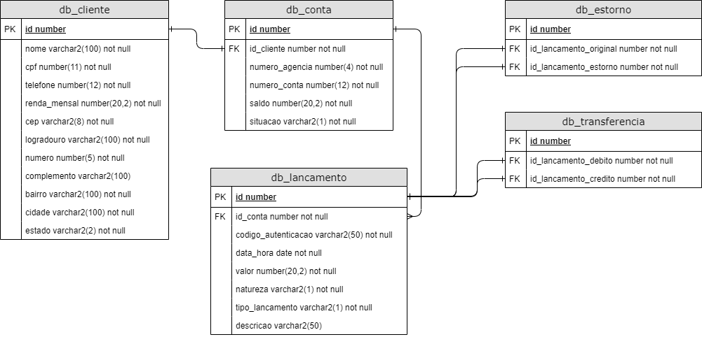

# Digital Bank

```


```

## Projeto

- ### Especificações técnicas

  - **Linguagem de programação:** Java - JDK 8 ou superior
  - **Gerenciador de dependências:** Maven 3 ou superior
  - **Spring Boot:** 2.2.4
  - **Banco de dados:** H2 database - http://localhost:8080/digitalbank/h2-console
  - **Testes unitários:** JUnit 5 + Mockito
  - **Testes de integração:** JUnit 5 + Rest Assured + Hamcrest
  - **Swagger**: [swagger.yaml](etc/swagger.yaml)
  - **Postman**: [Digitalbank.postman_collection.json](etc/Digitalbank.postman_collection.json)

- ### Modelagem

  

- ### Representações

  Os modelos de entrada e saída são representados no formato JSON

  _ClienteRequestDTO_

  ```json
  {
    "nome": "Pedro",
    "cpf": "74739910004",
    "telefone": 987665214,
    "rendaMensal": 10000.0,
    "logradouro": "Av. São Paulo",
    "numero": 120,
    "complemento": "Casa",
    "bairro": "Centro",
    "cidade": "Maringá",
    "estado": "PR",
    "cep": "85006854"
  }
  ```

  _ClienteResponseDTO_

  ```json
  {
    "dados": {
      "id": 1,
      "nome": "Pedro",
      "cpf": "74739910004",
      "telefone": 987665214,
      "rendaMensal": 10000.0,
      "logradouro": "Av. São Paulo",
      "numero": 120,
      "complemento": "Casa",
      "bairro": "Centro",
      "cidade": "Maringá",
      "estado": "PR",
      "cep": "85006854"
    }
  }
  ```

  _ContaResponseDTO_

  ```json
  {
    "dados": {
      "idCliente": 1,
      "idConta": 1,
      "numeroAgencia": 1,
      "numeroConta": 987665214,
      "situacao": "A",
      "saldo": 0
    }
  }
  ```

  _LancamentoRequestDTO_

  ```json
  {
    "valor": 100.0,
    "descricao": "Lançamento"
  }
  ```

  _TransferenciaRequestDTO_

  ```json
  {
    "numeroAgencia": 1,
    "numeroConta": 995410233,
    "valor": 50.0,
    "descricao": "Transferência"
  }
  ```

  _ComprovanteResponseDTO_

  ```json
  {
    "dados": {
      "idLancamento": 1,
      "codigoAutenticacao": "e2758c09-3539-4af9-b14b-66f561208b53",
      "dataHora": "31-12-2020 15:37:28",
      "valor": 50.0,
      "natureza": "D",
      "tipoLancamento": "T",
      "numeroAgencia": 1,
      "numeroConta": 995410233,
      "descricao": "Transferência"
    }
  }
  ```

  _ExtratoResponseDTO_

  ```json
  {
    "dados": {
      "conta": {
        "idCliente": 1,
        "idConta": 1,
        "numeroAgencia": 1,
        "numeroConta": 987665214,
        "situacao": "A",
        "saldo": 50.0
      },
      "lancamentos": [
        {
          "idLancamento": 1,
          "codigoAutenticacao": "e2758c09-3539-4af9-b14b-66f561208b53",
          "dataHora": "31-12-2020 15:37:28",
          "valor": 50.0,
          "natureza": "D",
          "tipoLancamento": "T",
          "numeroAgencia": 1,
          "numeroConta": 995410233,
          "descricao": "Transferência"
        }
      ]
    }
  }
  ```

- ### Requisições

  - **clientes**

  | Método | URL                                              | Entrada             | Saída                               |
  | ------ | ------------------------------------------------ | ------------------- | ----------------------------------- |
  | POST   | http://localhost:8080/api/v1/clientes            | _ClienteRequestDTO_ | 201 (Created)                       |
  | GET    | http://localhost:8080/api/v1/clientes            |                     | 200 (OK) Lista _ClienteResponseDTO_ |
  | GET    | http://localhost:8080/api/v1/clientes/{id}       |                     | 200 (OK) _ClienteResponseDTO_       |
  | PUT    | http://localhost:8080/api/v1/clientes/{id}       | _ClienteRequestDTO_ | 204 (No Content)                    |
  | DELETE | http://localhost:8080/api/v1/clientes/{id}/conta | _ContaResponseDTO_  | 200 (Ok)                            |

  - **contas**

  | Método | URL                                                                               | Entrada                   | Saída                                   |
  | ------ | --------------------------------------------------------------------------------- | ------------------------- | --------------------------------------- |
  | GET    | http://localhost:8080/api/v1/contas                                               |                           | 200 (OK) Lista _ContaResponseDTO_       |
  | POST   | http://localhost:8080/api/v1/contas/{id}/bloquear                                 |                           | 204 (No Content)                        |
  | POST   | http://localhost:8080/api/v1/contas/{id}/desbloquear                              |                           | 204 (No Content)                        |
  | POST   | http://localhost:8080/api/v1/contas/{id}/depositar                                | _LancamentoRequestDTO_    | 200 (Ok) _ComprovanteResponseDTO_       |
  | POST   | http://localhost:8080/api/v1/contas/{id}/sacar                                    | _LancamentoRequestDTO_    | 200 (Ok) _ComprovanteResponseDTO_       |
  | POST   | http://localhost:8080/api/v1/contas/{id}/pagar                                    | _LancamentoRequestDTO_    | 200 (Ok) _ComprovanteResponseDTO_       |
  | POST   | http://localhost:8080/api/v1/contas/{id}/transferir                               | _TransferenciaRequestDTO_ | 200 (Ok) _ComprovanteResponseDTO_       |
  | GET    | http://localhost:8080/api/v1/contas/{idConta}/lancamentos                         |                           | 200 (Ok) Lista _ComprovanteResponseDTO_ |
  | GET    | http://localhost:8080/api/v1/contas/{idConta}/lancamentos/{idLancamento}          |                           | 200 (Ok) _ComprovanteResponseDTO_       |
  | DELETE | http://localhost:8080/api/v1/contas/{idConta}/lancamentos/{idLancamento}          |                           | 204 (No Content)                        |
  | POST   | http://localhost:8080/api/v1/contas/{idConta}/lancamentos/{idLancamento}/estornar |                           | 200 (Ok) _ComprovanteResponseDTO_       |
